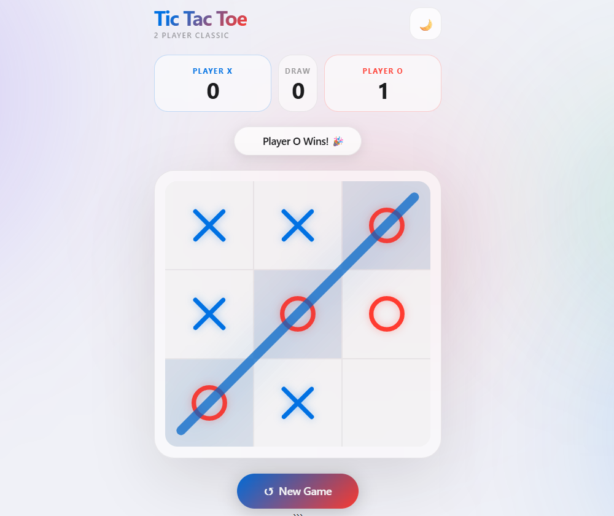

# ✨ Tic Tac Toe Web App

A sleek and modern **Tic Tac Toe** game built using **HTML, CSS, and JavaScript** featuring glassmorphism UI, animated SVG effects, score tracking, and dark/light theme support.

---

## 🌐 Live Demo

🔗 https://yourusername.github.io/tic-tac-toe-webapp/

---

# 📸 Preview





---

# 🚀 Features

- 🎨 Modern Glassmorphism UI
- 🌙 Dark / Light Theme Toggle
- ✨ Animated SVG X & O Marks
- 🏆 Live Score Tracking
- 🎯 Win-Line Animation
- 📱 Fully Responsive Design
- 🌌 Floating Background Particles
- ⚡ Smooth Hover & Transition Effects
- 🧠 Clean Vanilla JavaScript Logic

---

# 🛠️ Tech Stack

- HTML5
- CSS3
- Vanilla JavaScript
- SVG Animations

---

# 📂 Project Structure

```bash
tic-tac-toe-webapp/
│
├── index.html
├── README.md
└── assets/ (optional)
```

---

# ⚡ Getting Started

## 1️⃣ Clone the Repository

```bash
git clone https://github.com/Zephyrex21/Tic-Tac-Toe.git
```

---

## 2️⃣ Open Project Folder

```bash
cd tic-tac-toe-webapp
```

---

## 3️⃣ Run the Project

Simply open:

```bash
index.html
```

in your browser.

OR use the VS Code Live Server extension.

---

# 🎮 Gameplay

- Player X starts first
- Players take turns placing marks
- First player to align 3 marks wins
- Scoreboard updates automatically
- New Game button appears after every match

---


# 🤝 Contributing

Contributions, suggestions, and improvements are welcome.

Fork the repo and create a pull request 🚀

---

# 📜 License

This project is licensed under the MIT License.

---

# 👨‍💻 Author

Made with ❤️ by Saurabh Raj Shekhar

GitHub: https://github.com/Zephyrex21/
